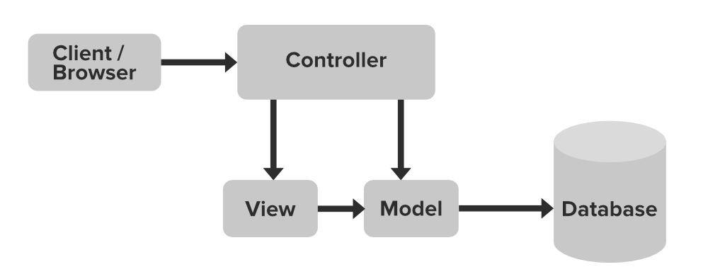
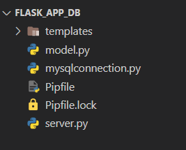
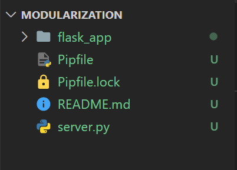
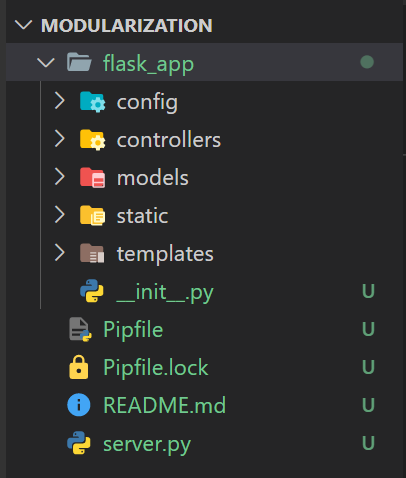
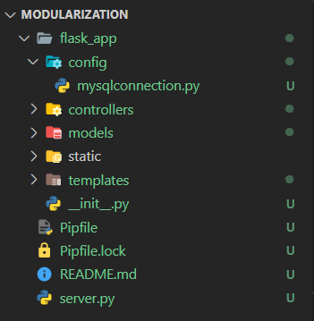
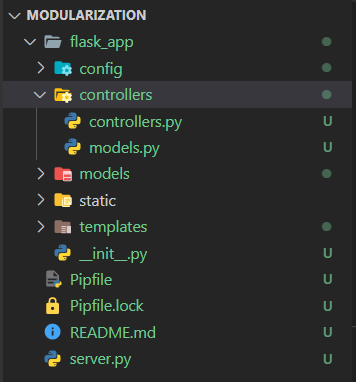
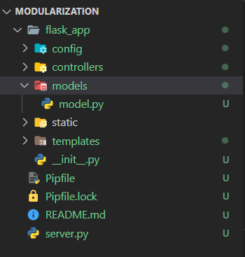
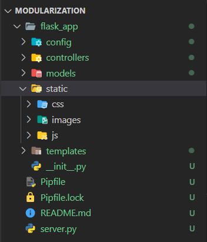
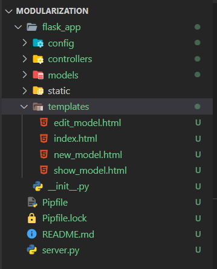

<!-- .slide:data-background="#000000" -->

---
<!-- .slide:data-background="#000000" -->
# CRUD Continued
---
## MVC
--

<!-- .element: data-trim class="r-stretch r-fit-text" -->
--

<!-- .element: data-trim class="r-stretch r-fit-text" -->
---
## Modularization
--
### We started with three files
1. `server.py`   <!-- .element: class="fragment" -->
2. `mysqlconnection.py`   <!-- .element: class="fragment" -->
3. `model.py`   <!-- .element: class="fragment" -->

--
### Our file structure looked like this:

<!-- .element:class="r-stretch" -->
<!-- .element:class="fragment" -->
--

--

--

--

--

--

--

---
## Controllers
--
## Controllers
- controllers handle routes/requests and <!-- .element: class="fragment" -->
- minimal logic (fat models, skinny controllers) <!-- .element: class="fragment" -->
- access database via models <!-- .element: class="fragment" -->
---
## Models
--
## Models
- models handles logic related to data <!-- .element: class="fragment" -->
- access database via mysqlconnection.py <!-- .element: class="fragment" -->
---
## User's CRUD Modularized
---
## relationships
---
## dojos and ninjas (core)
---
## relationships advanced
---
## circular imports
---
## books (practice)
---
## friendships (optional)

